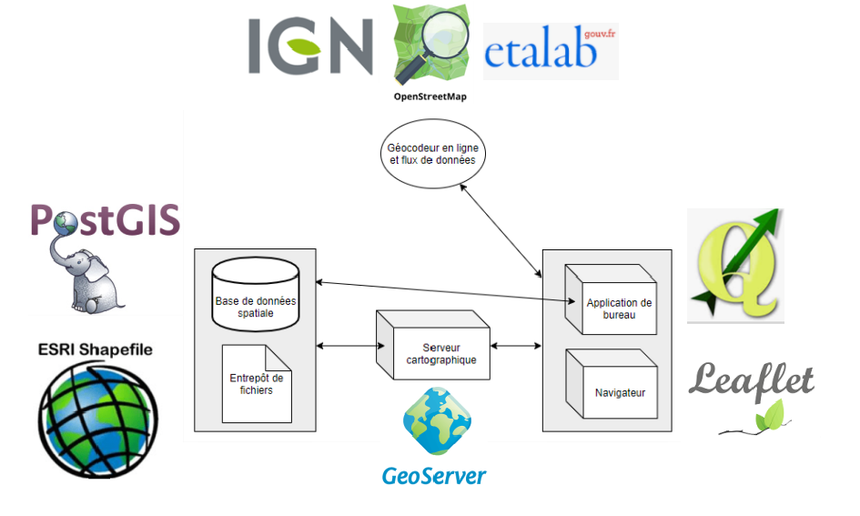

Comment s'articulent ces outils et acteurs autour de la géographie?
===================================================================

Parcequ'un schéma vaut mieux qu'un long discours 
------

Un implémentation partielle de ce schéma 
------
exemple de mini-application web :
`application sous codepen`_

Cette application :
  - affiche des informations cartographiques dans un navigateur
  - utilise leaflet
  - fait appel à un geocodeur (celui de l'IGN basé sur la BAN) 
  - se connecte à OpenStreetMap
  - fait appel à un Geoserver (qui lui-même fait appel à une base de données ou à un entrepôt de fichier) pour afficher :
  
    - une couche image (appel en WMS)
    - une couche vectorielle (appel en WFS)

Vous avez accès aux 3 composantes du code (html, css, et javascript) que vous pouvez manipuler à loisir. Vous pouvez également dupliquer le code sur un projet à vous ou, par exemple, sous codepen.io ou jsfiddle.net en vous créant un compte. Vous pourrez ainsi enregistrer vos modifications.

.. _application sous codepen: https://codepen.io/fabcg/pen/wvWGQdW
