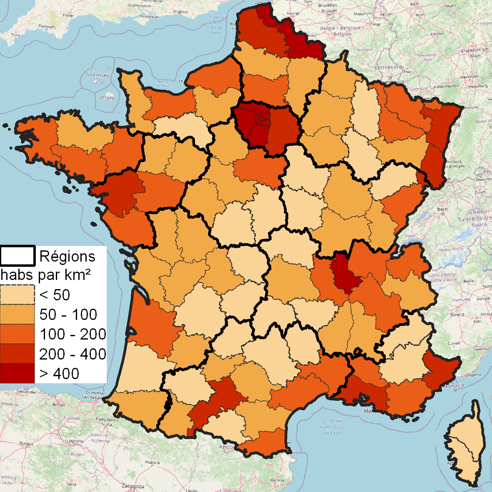
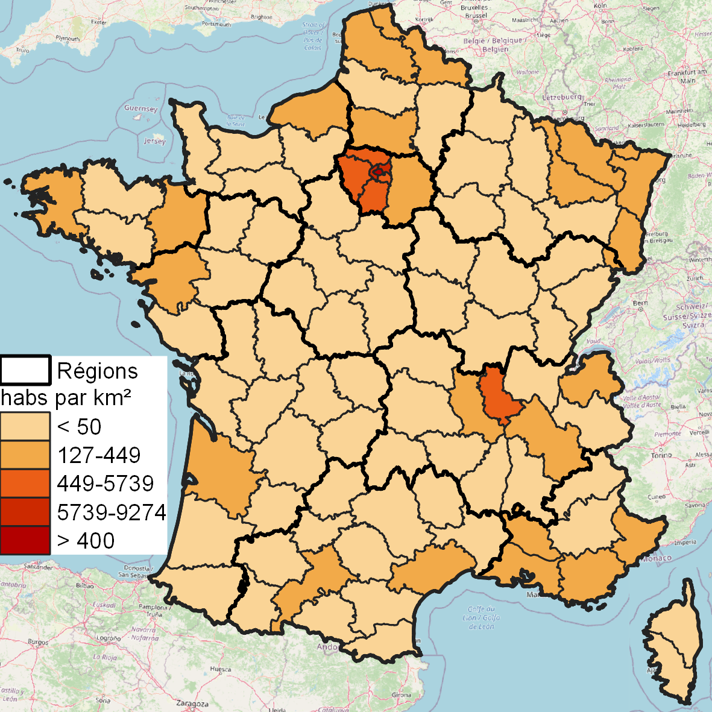

Cartes statiques
====================

   
   1-Densité de Population en France métropolitaine en 2020. Source : Insee
   

Une carte thématique est un ensemble d'éléments assemblés les uns aux dessus des autres. Le premier est le fond de carte portant l'information statistique, le second la légende qui permet de comprendre la carte et enfin les sources qui garantissent l'attribution des données. A ce triptyque primaire, on peut rajouter des informations supplémentaires apportées par des couches spécifiques. Dans notre exemple, on a rajouté une couche des régions françaises ainsi qu'un fond OpenStreetMap afin d'apporter un contexte spatial. L'ordre d'apparition des fonds conditionne leur visibilité.

Un peu de discrétisation
-------------------------

La discrétisation est une étape indispensable pour transformer une variable continue en une carte thématique de type aplat de couleur. Cette opération est tout sauf neutre et engage le cartographe. Sur les deux cartes suivantes sont représentées les deux méthode de discrétisation le splus utilisées :  quantiles et Jenks.

.. figure:: _static/carte_finale_quantiles.png
   :width: 200
   
   2-Discrétisation Quantile

   
   3-Discrétisation Jenks

La discrétisation quantile  (figure 2) est ultra rapide même employée sur de très gros fonds de carte. En revanche, elle a un énorme défaut, elle tend à produire de trop belles cartes. Comprenez par là que les cartes sont automatiquement équilibrées par construction, il y le même nombre d'unités spatiales dans chaque classe. Certains statisticiens ne jurent que par elle et ne peuvent plus s'en passer, ce qui représente un vrai sujet de santé statistique. On constate dans notre exemple que les tailles des classes sont relativement homogéne, ce qui a pour conséquence une invisibilisation des valeurs extrèmes observées dans les départements contenant une métropole.

La discrétisation de Jenks (figure 3) est très lente (pour les gros fonds de carte) et consiste à chercher les bornes qui garantissent l'homogénéité au sein des classe et l'hétérogénité maximale entre les classes. Certains logiciels proposent de prendre un échantillon de la variable analysée pour gagner en temps de calcul. En théorie, c'est la discrétisation la plus à même de restituer la répartition d'une variable à cartographier. En pratique le résultat est parfois décevant. Dans notre cas, le département de Paris écrase totalement la discrétisation. 

En soi, aucune discrétisation n'est meilleure qu'une autre. Toutes les cartes portent un message qui est dans une certaine mesure pertinent. D'un côté la carte en Jenks refléte la macrocéphalie urbaine de Paris et la carte en quantiles l'inégale peuplement des espaces ruraux. Néanmoins en disant cela, on ne vous aide pas, car on a rarement la possibilité de faire deux fois la même carte avec des discrétisations différentes. Pour la carte de la figure 1, nous avons adopté une autre stratégie en nous inspirant du fait que les distributions de population suivent généralement de _Zipf:http://geoconfluences.ens-lyon.fr/glossaire/zipf-loi-ou-regle-de , ce qui légitime le recours à une progression géométrique pour décrire une distribution de population. Une autre manière d'orienter le choix des classes et de questionner leur usage. En discrétisant, on introduit un changement de nature entre des situations décrites par des variables continues. De sorte que les bornes des classes peuvent être comprises comme des seuils d'action publique. Dans le cas de notre population, une variation de plus ou moins 5%, voire même de 20% des densités ne transforment pas totalement le mode de vie des habitants. Un territoire rural reste toujours rural et de même pour une ville. Si l'on suppose que la nature des modes de vie est une fonction logarithmique de la densité, le recours à des bornes géométrique se trouve conforté. Ces bornes ont tendances à séparer les départements très peu denses des départements très urbanisés et autorise des états intermédiaires. L'idée que les modes de vie dépendent de la densité de façon non linéaire est un sujet de recherche en _géographie: https://hqlo.biomedcentral.com/articles/10.1186/s12955-019-1172-3 . Sans que cela représente une preuve en soi, on peut appréhender notre appréciation des densités à l'aide des figures suivantes. Il est difficile de juger visuellement des différences de densités !

