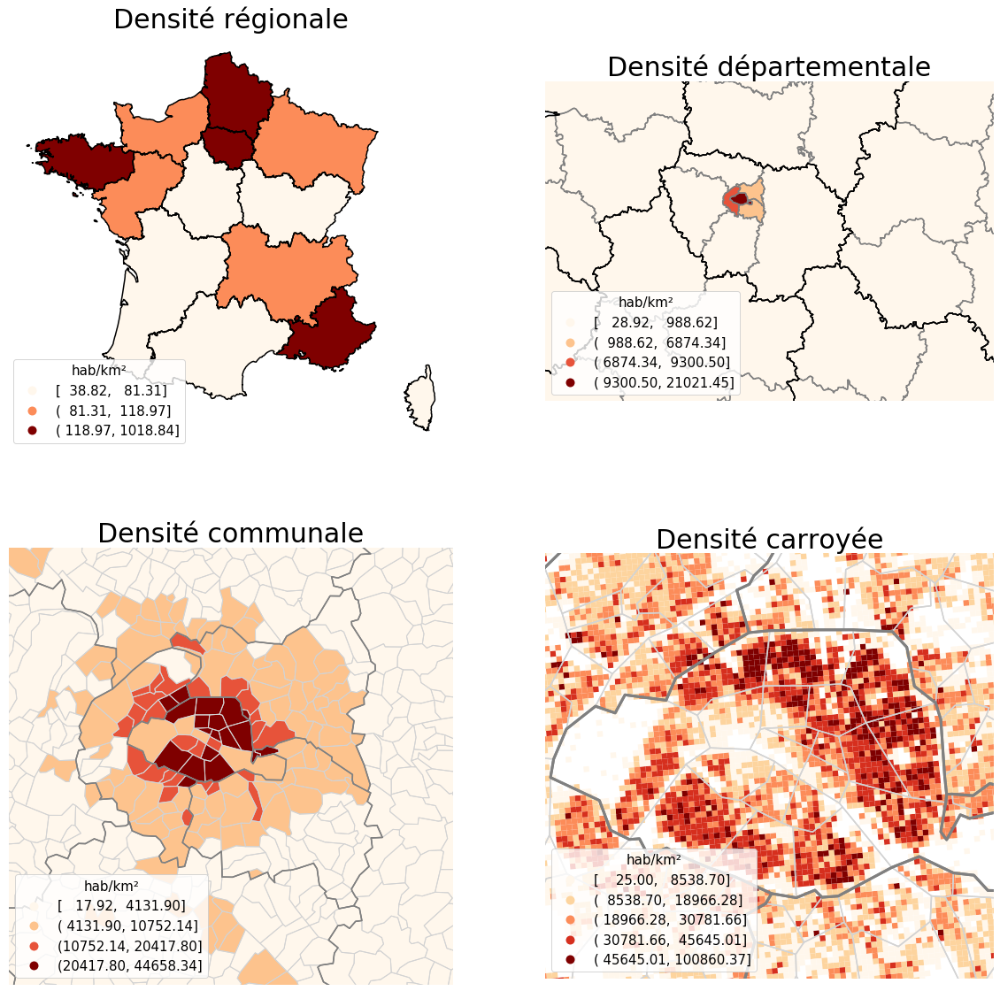
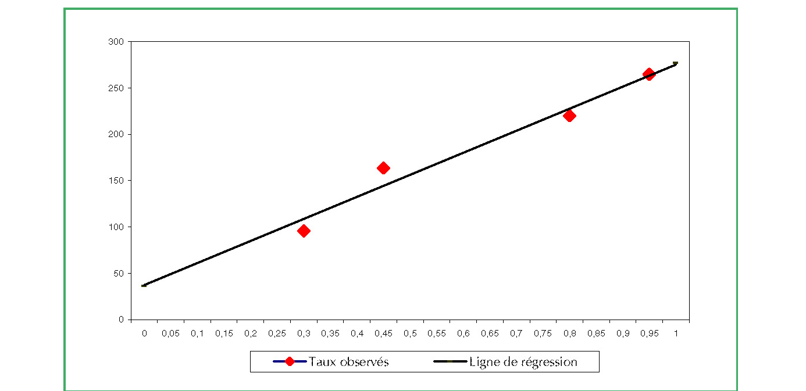
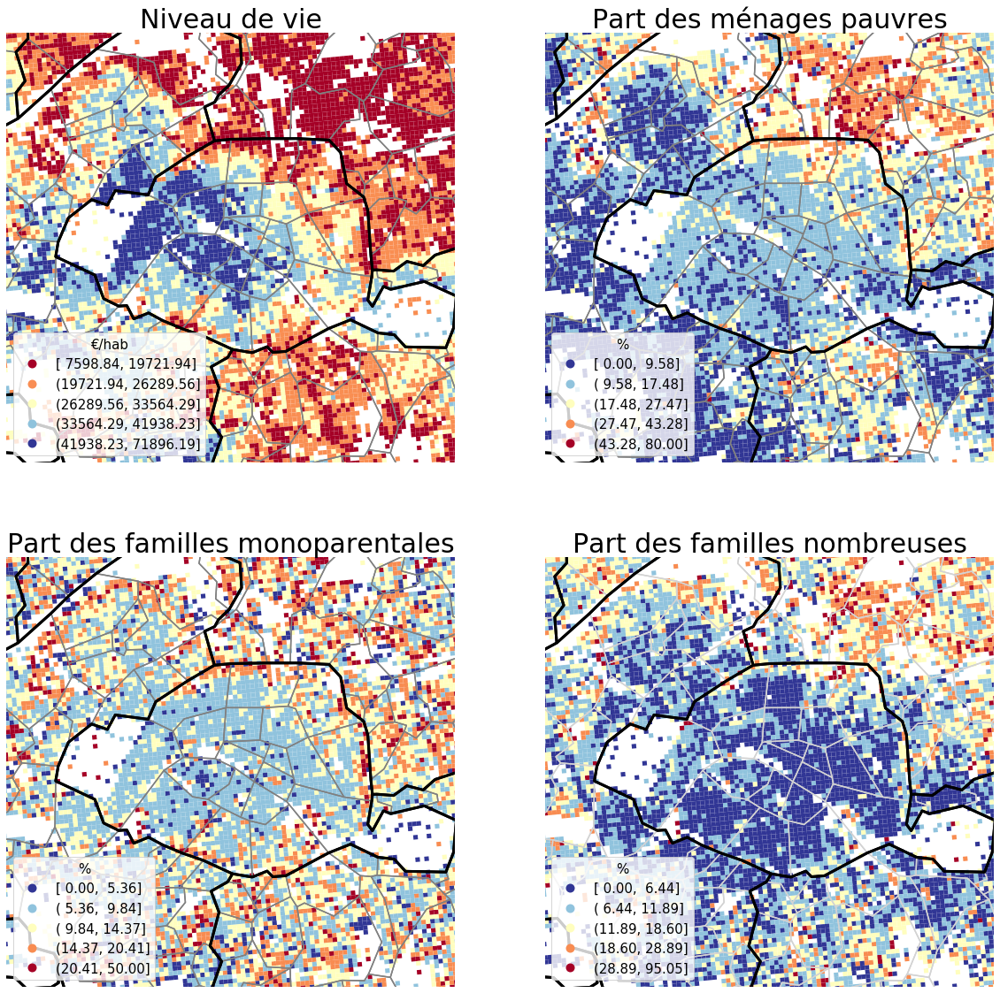

La spatialisation des données statistiques
===========================================

Le Modifiable Areal Unit Problem
---------------------------------

Même si les données ont une précision métrique, la production d'un savoir géographique nécessite de les relier entre elles à l'aide de régles spatiales, autrement dit de spatialiser les données. La spatialisation constiste à associer à chaque objet une portion, une quantité d'espace bien défini. Cette mise en relation spatiale s'apparente à un *point de vue* que l'on se donne afin de rendre intelligible les distributions spatiales. Ce point de vue opére comme un filtre qui met en valeur certaines propriétés spatiales et en délaisse d'autres. Il en résulte que les analyses géographiques ont donc toujours une part d'arbitraire et sont fonctions de la spatialisation choisie.

La difficulté à définir de façon univoque la concentration d'un ensemble de point illustre les effets de la spatialisation sur les analyses. Intuivement, un ensemble de points est aggloméré lorsque les voisinages autour de ses points se chevauchent. Cette idée a été formalisée dans la fonction de Ripley à l'aide de disque centré sur les points. En fonction de la taille des disques, le même ensemble de points peut apparaître plus ou moins concentré.

Rajouter un graphique

Openshaw a théorisé sous le concept de *Modifiable Areal Unit Problem* la dépendace des analyses à la spatialisation. Le MAUP se décompose en deux effets interdépendants : l’effet de zone et l’effet d’échelle. L'effet de zone exprime la dépendance des résultats statistiques à la forme des mailles territoriales. Dans l'image ci-dessous, en fonction de l'endroit ou passe la frontière les taux de malade sont particulièrement variables. Le redécoupage des zones éléctorales après une éléction afin de maximiser la réélection des acteurs publics est un exemple courant d'effet de zone réalisé volontairement. En anglais, le Gerrymandering désigne cette pratique en référence à l'homme politique américain Elbridge Gerry qui l'a poussée à son paroxysme.

.. figure:: _static/Maup_rate_numbers.png
   :width: 300
   
   Illustration du MAUP. Source : Wikipédia

Dans les analyses statistiques, on peut se prémunir en partie des effets de zone en recourant à des découpages réguliers tels que des carroyages ou bien encore en réalisant des lissages spatiaux. En revanche, on ne peut quasiment rien faire quant aux effets d'échelle - le choix du rayon dans la définition de la concentration d'un ensemble est un effet d'échelle - ils sont inhérents à la prise en compte de l'espace dans les analyses statistiques. Les 4 cartes de densité de la figure ci-dessous témoignent des effets d'échelle sur un indicateur statistique simple : il est impossible de définir une densité dans l'absolu. Néanmoins, ceci ne veut pas dire que la densité évolue n'importe comment en fonction de la taille des unités spatiales. Généralement, la variabilité spatiale des densités augmente avec la finesse de l'échelle d'analyse. Ceci s'explique par le fait qu'aux échelles grossières, les unités spatiales incorporent et moyennisent des zones de densité très variable.   

   Effets d'échelle. Source : RP 2017
   
Jusqu'a récemment, le Maup était considéré comme une limite à la connaissance géographique. Dans le meilleur des cas, les statisticiens et les géographes le *résolvaient*  en recherchant une échelle caractéristique au phénomène étudié ou en utilisant l'échelle d'action des acteurs publics. Cette démarche n'allait pas sans poser de problème :

* Sur quel critére peut-on se baser pour définir une échelle caractéristique optimale ? 
* L'échelle d'action de l'acteur public n'est pas forcément la plus pertinente pour explorer un phénomène spatial (cf en dessous le piége territorial). 

A présent, le MAUP est pensé comme une source d'information sur l'organisation spatiale des distributions étudiées. Plus précisément, la variation des indicateurs à travers les échelles dévoile le caractère multiscalaire des distributions spatiales étudiées. C'est-à-dire que pour comprendre l'organisation d'une distribution spatiale, on doit nécéssairement l'observer à différentes échelles. 

L'erreur écologique
--------------------
Dans son article liminaire sur le MAUP, openshaw relie celui-ci à l'erreur écologique. Cette erreur, bien connu des statisticiens, désigne le fait que l'on ne peut pas déduire à partir de statistiques agrégées (sur des unités spatiales) une connaissance à l'échelle des individus. L'analyse de Durkheim sur la prévalence du suicides selon la confession religieuse à l'échelle des provinces de la Prusse est souvent citée comme un exemple manifeste d'erreur écologique (Daniel Cuurgeau 2000). 

   Taux de suicide selon la part de protestants pour les provinces de Prusse (1883-1990). Source : Durkheim tirée de Courgeau 2000. 

La linéarité des taux de suicide en fonction de la part des protestants permet à Durkheim d'extrapoler un taux de suicide pour les protestants. Courgeau 2000 observe cependant que ce taux est quatre fois supérieur à celui calculé directement au niveau des individus. Ceci s'explique intuitivement par le fait que le taux de suicide des protestants et des catholiques dans les provinces de Prusse ne sont pas constants. Les conditions de vie varient selon la part plus ou moins importante de catholique et de protestant. Il en résulte que l'environnement des protestants (sont-ils majoritaires ou minoritaires dans leur province) influence leur propention individuelle à se suicider. AUtrement dit, il y a des interractions entre les groupes religieux.

Le caractére extrême de cet exemple se rencontre néanmoins rarement dans les analyses statistiques et géographiques usuelles. L'existence de relations linéaires parfaites entre les variables est peu fréquence. Il n'en reste pas moins que l'on peut rapidement en juxtaposant des cartes suggérer des corrélations fallacieuses. 

   
   Organisation spatiale de la pauvreté autour de Paris. Source : Filosofi 2015
   
Les quatres cartes précédentes opposent les quartiers aisés de l'ouest Parisien à ceux de l'est et du nord-est Parisien. Elles suggérent (même imparfaite) l'existence d'une corrélation entre 4 phénomènes sociaux distincts dont le mesusage est susceptible de produire des biais interprétatifs :

-  On pourrait faussement en déduire que les personnes âgées sont relativement épargnées par la pauvreté. Ceci est absolument faux, le revenu des personnes âgées est totalement comparable à celui des autres ménages ;
- Mettre au même plan les familles monoparentales et la pauvreté incite à penser que cette première est une défavorisation. Or dans les quartiers aisées, une partie des familles monoparentales sont elles-mêmes aisées. Un rapprochement trop rapide entre ces deux variables peut amener à vehiculer des préjugés hétérnormatifs.
- Il en est de même avec les familles nombreuses : dans les quartiers aisées, les familles nombreuses sont aisées également. Un usage mal contrôlé de la  corrélation spatiale entre ces deux variables est susceptible de reproduire implicitement des préjugés raciaux.  

Le titre de la figure "Organisation spatiale de la pauvreté autour de Paris" est piégeux. Un titre beaucoup plus neutre devrait être choisi pour ne pas induire en erreur le lecteur. Il est également important de faire attention au vocabulaire spatial mobilisé pour décrire les cartes. Par exemple, le terme banlieue est connoté négativement en France et véhicule de nombreux lieux communs. Prévilégier des termes plus neutres permet de ne pas orienter le lecteur dans une lecture spatiale simpliste.

Le piége territorial
---------------------

Quelle est la nature des informations contenues dans une carte ? Cette question n'est pas purement réthorique comme le confirme le questionnement des géographes et les sociologues au sujet de l'usage de l'espace dans la production d'un savoir scientiques :   

« Il n’est pas question de nier l’importance des facteurs urbains dans le développement des problèmes sociaux. Mais en centrant les analyses de cette façon on a sans doute hypertrophié la responsabilité des urbanistes et des architectes dans les difficultés actuelles des " quartiers". Cette manière de s’exprimer, devenue usuelle, est d’ailleurs révélatrice du déplacement opéré. Ce sont les quartiers qui posent problème, et plus le chômage, la formation, la famille, l’intégration. Tout se passe comme si la dégradation des quartiers était posée
comme cause avant d’être examinée comme conséquence » PINÇON et PINÇON-CHARLOT

Le piége territorial théorisé par John Agnew consiste à surinterpréter le rôle de l'espace dans la production des phénomènes sociaux. Les cartes de en mettent en exergue les territoires contenant une sureprésentation de certaines populations sont susceptibles de favoriser le piége territorial. Elles proposent une vision du monde qui s'intéresse plus aux territoires qu'aux populations sous-jacentes. A contrario, les cartes de densité quantifient la répartition des sous populations dans l'espace.

Insérer les cartes

Les populations défavorisées ne sont pas uniquement dans les quartiers ou elles sont majoritaires mais également dans les quartiers aisés. Ceci ne veut pas dire que les cartes de taux soient fausses mais elles sont d'autant plus pertinentes qu'une sur représentation de populations défavorisées représente en soi une défavorisation. C'est-a-dire lorsque la ségrégation produit des effets sur les populations que les acteurs publics souhaitent corriger. Dans le cadre des politiques urbaines de réduction des inégalités, cet effet bien que discuté est vérifié empiriquement : la mixité est valorisée socialement pour réduire les effets des inégalités spatiales. Pour autant, on ne saurait réduire l'étude de la pauvreté aux territoires ségrégés. 

En revanche, toutes les concentrations spatiales ne peuvent pas être considérées de la même manière. Par exemple, une sureprésentation de personnes agées ne seurait être une inégalité spatiale. Dans ce cas, le choix de la localisation d'un équipement à destination de ce public nécessite l'étude des deux types de cartes (concentration et densité).   

