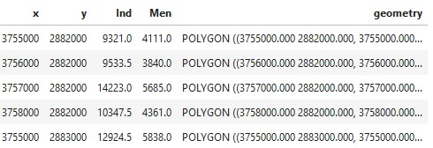

Fichiers Géographiques
=================================================================================================

La liste des différents formats des fichiers géographiques est pléthorique. Le plus connu et le plus utilisé est le format Shapefile, il est le format d'ESRI (logiciel ARCGIS). Un fond de carte est composé par 5 fichiers : le .shp qui est la porte d'entrée sur les données, un fichier .dbf qui contient les données attributaires (les données associées aux objets contenus dans le shapefile) et d'autres fichiers qui gérent la projection est la géométrie. Il est nécessaire que tous les fichiers soient au même emplacement pour qu'un Shapefile puisse être ouvert par un SIG.

D'autres formats tendent progressivement à s'imposer. La communauté Qgis propose le format Geopackage. Les données sont contenues dans un unique fichier d'extension *.qgz. Ce format risque de surclasser le format shapefile dans le futur. Le format geojson est très adapté aux données web mais il est particulièrement volumineux. En effet, ce format qui est une extension de json n'est pas compressé et correspond à un dictionnaire. Voici un exemple de fichier geojson :

L'avantage du geojson est qu'il peut être lu par n'importe quel outil. Les plus anciens se rappelleront le format MIF-MID de Mapinfo qui était également un format texte et qui présentait comme le format geojson l'avantage de pouvoir être écrit à la main. Dans tous les cas, les SIG modernes sont généralement capables de lire tous les formats disponibles et vous pouvez facilement ouvir un fichier et le sauvegarder dans un autre format facilement.

Dans les logiciels statistiques R et Python (Geopandas), la géométrie est intégrée à la dataframe sous la forme d'une colonne supplémentaire. De sorte que quel que soit le format, une fois dans votre logiciel de prédilection, toutes les données spatiales sont traitées de la même manière.

   
   Premières lignes d'une table carroyée. Les géométries sont dans la colonne geometry ! 
