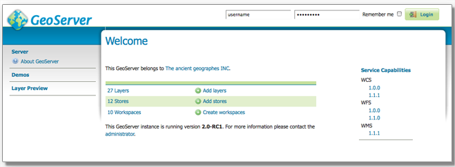

Geoserver
=================================================================================================

GeoServer est une application informatique open source, libre et interopérable écrite en java qui une fois installée sur un serveur permet de partager des données géographiques. Ces données peuvent provenir de différentes sources, les principales étant des bases de données ou des entrepôts de fichiers (externes ou pas).

Les données en entrée
------  
Les données sources peuvent être dans de nombreux formats dont 
    - PostGis
    - Oracle spatial
    - shapefile
    - geotiff
   
Les données en sortie
------
Les données en sortie sont fournies grâce à des protocoles d'échange, les plus connus étant
  - WMS (Web Map Service) : un protocole qui renvoie des images géoréférencées. Ces images ne contiennent pas d'information en dehors des coordonnées où elles doivent s'afficher
  - WFS (Web Feature Service) : ce protocole renvoie des données vectorielles dans différents formats (json, csv, shapefile, gml). Les informations géométriques récupérées peuvent s'accompagner de nombreuses informations complémentaires. Les objets récupérés sont manipulables. 
  
Outils de lecture
------
Les données revoyées par GeoServer peuvent être lues dans un logiciel SIG (QGis, MapInfo) ou dans un navigateur à l'aide de bibliothèques cartographiques (Leaflet, OpenLayers). Pour les WFS le style d'affichage des données peut être défini directement dans le geoserver ou dans le client (logiciel ou navigateur) qui va les lire.

La configuration
------
Le gros avantage de geoserver par rapport à certaines alternatives (MapServer, Mapnik...), c'est la possibilité de se connecter à l'application via une interface d'administration qui permet de n'avoir aucune compétences de programmation. Il est alors possible d'ajouter des couches depuis une ou plusieurs sources. 

L'interface offre par ailleurs d'autres possibilités comme l'activation d'un cache pour ne pas recalculer les données à chaque fois, l'édition ou la modification de styles, ou la modification des droits d'accès.

Exemples de mise en oeuvre
------
- mise en place d'une couche issue d'un shapefile
    https://docs.geoserver.org/latest/en/user/gettingstarted/shapefile-quickstart/index.html

- mise en place d'une couche en WMS issue d'une base de données
    https://docs.geoserver.org/latest/en/user/gettingstarted/postgis-quickstart/index.html

