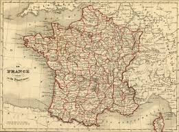

.. carto documentation master file, created by
   sphinx-quickstart on Fri Jul 17 11:01:39 2020.
   You can adapt this file completely to your liking, but it should at least
   contain the root `toctree` directive.

Sensibilisation à la cartographie
=================================

Description
---------------------

blabla introductif

.. toctree::
  :maxdepth: 1
  :caption: Mémento

  Commencer par quelques concepts théoriques sur la spatialisation des données <concepts>
  On s'exerce ! <gallery/index>
  Allez plus loin et gérer son SIG <sig>

Nous contacter
---------------------

- Reporter des bugs, suggérer des ajouts ou du code sur `GitHub`_.

.. _GitHub: https://github.com/JulieDjidji
