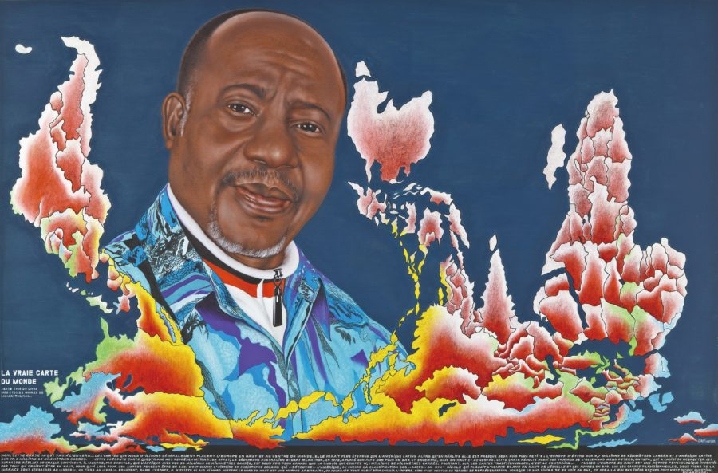

.. carto documentation master file, created by
   sphinx-quickstart on Fri Jul 17 11:01:39 2020.
   You can adapt this file completely to your liking, but it should at least
   contain the root `toctree` directive.

Les territoires de la cartographie
=================================

   
    Chéri Samba, La Vraie Carte du monde, 2011 (source : Fondation Cartier)

Les progrès de l’informatique ont décuplé la capacité des acteurs publics et privés à diffuser des cartes statistiques. Il n’a jamais été aussi simple de produire et de communiquer une information statistique à l’aide d’une carte. Ce constat est néanmoins à tempérer, car la cartographie statistique reste toujours une pratique d’initiés. Pour le profane, la cartographie ressemble à une nébuleuse inextricable composée de concepts jargonant. Ce site vise à vous familiariser avec les notions de la cartographie et à vous présenter les principales solutions techniques utilisées actuellement. Il ne se veut pas une présentation exhaustive (nous ne traitons pas en particulier les images : photographies aériennes) mais plutôt une entrée en matière afin de démythifier la cartographie.

.. toctree::
  :maxdepth: 1
  :caption: Introduction
  
  Pourquoi faire des cartes ? <pourquoi>
  Tour d'horizon des acteurs <acteurs>
  Les objets géographiques <acteurs>

.. toctree::
  :maxdepth: 1
  :caption: Stockage des données spatiales
  
  Les projections ! <projections>
  Les fichiers cartographiques  <fichiers_geo>
  Les bases de données spatiales Postgis <postgis>
  
Dans cette partie, nous nous intéréssons aux différentes possibilités existantes pour stocker l'information géographique. Initialement, le principal outil de stockage était le fichier cartographique. Progressivement, des bases de données spatiales, POSTGIS extension de POSTGRESQL et SpatiaLite extension de SQLite, ont été élaborées pour traiter de grands volumes de données. En pratique avec les outils modernes, la manipulation d'une base de données ou d'un fichier géographique se ressemble de plus en plus. La dimension spatiale apparait comme une colonne supplémentaire qui décrit pour chaque observation son emprise spatiale associée. Par exemple, une commune convexe est décrite par un polygon composé d'une succession de coordonnées correspondant aux sommets : POLYGON((X_1, Y_1), (X_2, Y_2)). Une commune disposant d'une exclave est décrite par la réunion de deux polygons. On parle dans ce cas de MULTIPOLYGON.   
 
.. toctree::
  :maxdepth: 1
  :caption: Maipulation des données spatiales
   
   Qgis, la boite à outils du cartographe <qgis>
   Requêtes spatiales sous SQL <postgis>
   La localisation des données géos : quels outils de géocodage ? <geocodage>

Deux grands types de traitements existent. Le premier type a vocation à produire à partir d'une ou de plusieurs informations géographiques une nouvelle information. Par exemple, pour construire des tâches urbaines, on calcule autour des bâtiments une zone "tampon". Cette nouvelle couche peut être utilisée ensuite dans d'autres traitements. Les opérations les plus courantes sont : l'intersection et l'union géographiques, l'aggrégation spatiale (on rassemble les communes d'un même département pour créer un fond départemental), les buffers (zones tampons), mais aussi calcul de surfaces, de distances et de longueurs. Le deuxième type cherche à joindre les objets selon leurs relations spatiales. Par exemple, si je souhaite connaitre les lieux qui tombent dans un territoire je vais réaliser un merge spatial qui consiste à trouver le territoire d'appartenance d'une liste de points. 

Tous les outils de traitement géographique, y compris le SQL, ont des fonctions similaires avec  des noms quasi-identiques. De sorte qu'il est très facile de passer d'un outil à l'autre.  

.. toctree::
  :maxdepth: 1
  :caption: Diffusion

  La sémiologie : une grammaire spatiale  <semio> 
  Heurs et malheurs de la spatialisation des données statistiques <concepts>
  Une première carte statique (et discrétisation des aplats de couleurs)<carte_stat>
  Geoserver <geoserver>
  Leaflet <leaflet>
  Comment tout cela s'articule-t-il? <articulation>
  Un exemple d'implémentation <implementation>
  
Les cartes de diffusion repose sur une grammaire : la sémiologie. La sémiologie est un ensemble de régles qui favorise l'appropriation par les lecteurs du message contenu dans les cartes. Ces régles sont basées sur un consensus et ont pour fondement notre capacité à se représenter l'espace. Une analyse de ces régles et de leurs conséquences est données dans les deux premiers items de cette parte. Les items suivants explicitent les cartes statiques et les cartes dynamiques. Une carte dynamique repose sur un ou plusieurs serveurs qui délivrent l'information en fonction de la zone observée par les utilisateurs. Geoserver peut être adossé à Postgis pour diffuser des couches géographiques sous forme de flux. La solution Postgis-Geoserver est très utile et performante mais nécessite de disposer d'un server. Il est également possible d'utiliser un service dédié tel que Mapbox pour diffuser des données géographiques. Dans ce cas, on confie à un tiers les données qui se charge de mettre à disposition des flux.  
 
  

.. toctree::
  :maxdepth: 1
  :caption: On s'exerce !
  
  Mini présentation de GeoPandas <geopandas>
  Galerie d'exemples <gallery/index>
  Postgis sous Python <postgisPy>
  
.. toctree::
  :maxdepth: 1
  :caption: Contributeurs

   Contributeurs <contributors>

Nous contacter
---------------------

- Reporter des bugs, suggérer des ajouts ou du code sur `GitHub`_.

.. _GitHub: https://github.com/JulieDjidji
