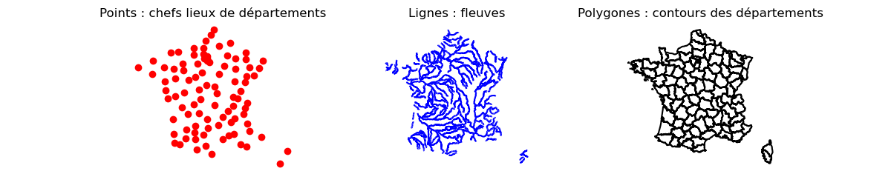

Les objets géographiques
=========================

R avec le package sf, Python avec Geopandas et Postgis exploitent pour décrire et manipulers les formes géométriques. De sorte que pour ces trois logiciels, la description des objets géographiques est similaire. Nous l'utilons pour présenter les trois principaux objects géographiques que sont le points, la ligne et le polygone. Un point est définie par deux coordonnées POINT(X,Y). Une ligne brisée par une succession de coordonnées LINESTRING(X1,Y1,X2,Y2...) représentant les points intermédiaires. Enfin, un polygne par une succession de coordonnées dont la première est égale à la dernière POLYGON(X1,Y1,X2,Y2,...,X1,Y1). Généralement le préfére MULTI permet de générer des objects plus complexes. Par exemple, un MULTIPOLYGON permet de représenter un territoire composés de deux parties non connexes, ce qui arrive très souvent.

   
   Les trois principaux types d'objects géographiques 
