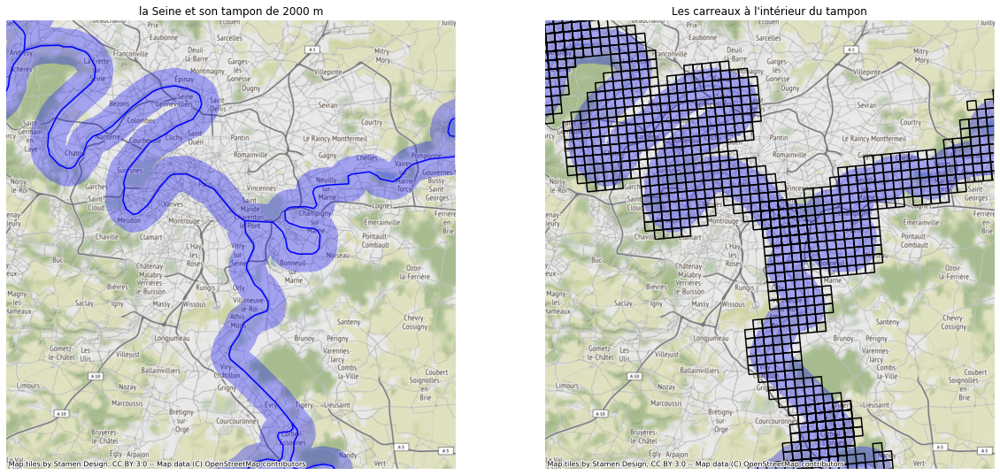
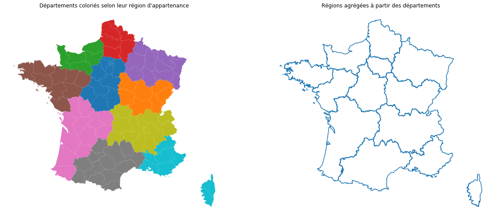
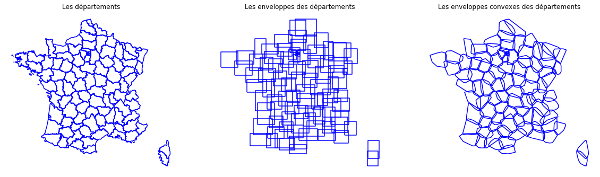

Les opérations géographiques
=============================

Les opérations géographiques sont principalement des opérations géométriques. Un calcul géomatique consiste généralement en l'enchainement de plusieurs de ces opérations.

La première opération que nous allons décrire est le buffer qui consiste à créer un tampon autour d'un object. Cette opération est utilisée pour créer une tache urbaine ou pour rechercher les carreaux innondables (à moins de 2 km d'un fleuve par exemple). 
Dans ce dernier cas, on procéde en deux étapes, on calcule un buffer de 2 km autour des fleuves puis on réalise un merge spatiale de cette nouvelle couche avec les carreaux.

   
   Recherche des zones innondables à l'aide d'un buffer

Une autre opération très courante et l'agrégation de données fines pour produire des données plus grossières. Par exemple, on utilise cette méthode pour reconstituer à partir d'un fond de carte départemental un fond de carte régionale. 

   
   Agrégation d'un fond départemental pour former un fond régional

On termine ce rapide survol par des fonctions de simplifications de la géométrie. L'envellope calcule pour chaque objet le rectangle le contenant. L'envellope convexe quant à elle calcul pour chaque objet le plus petit polygone convexe le contenant.

   
   Simplification d'un fond départemental (enveloppe et enveloppe convexe)
