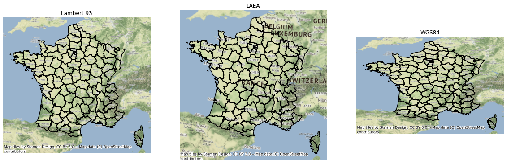
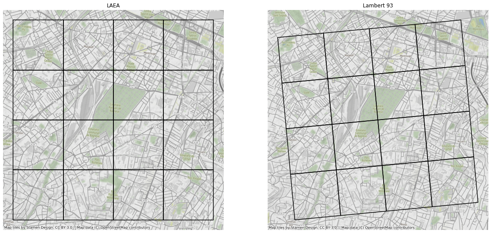

Projections
==============

Contrairement à ce qu'affirme la Flat Earth Society:https://www.tfes.org , la terre n'est pas plate mais sphérique. Ceci a pour principale conséquence que l'on doit en permanence faire face à des problèmes de projections. Une projection est une méthode permettant de transformer une surface sphérique en une surface plane:https://fr.wikipedia.org/wiki/Projection_cartographique . La principale difficultée avec les projections provient du fait que leur nombre est incommensurable. Chaque projection répond à un besoin particulier et est définie par un ensemble de norme. Par exemple, en France, les administrations sont censés utiliser la projection Lambert 93 centrée sur la France métropole. Cette projection a pour vocation de déformer le moins possible la France Métropolitaine. Ainsi, la distance calculée à l'aide d'une simple formule de Pythagore (distance vol d'oiseau) entre Lille et Marseille sur les coordonnées est de 833.812 km. La distance géodésique (pour faire simple la vraie distance) est de 834.005 km. L'approximation de Phythagore est très bonne en France métropolitaine. Ces d'ailleurs cette approche que l'on adopte généralement en statistique spatiale. En revanche une distance vol d'oiseau entre Lille et l'Australie génére une erreur de 1500 km !

 

On passe d'une projection à une autre, en effectuant une opération de reprojection. Cette opération peut être très longue en fonction de la taille de la couche cartographique. Il est donc important de bien réfléchir à adopter une projection unique dès le début d'un projet cartographique.

   
   Exemple de projections
   

Sur la figure 1, nous comparons l'effet de deux projections sur la France métropolitaine : Lambert 93, LAEA la projection adoptée par l'Europe et WGS84 . On constate une légère déformation entre les deux premières cartes. Cette déformation explique l'énigme des carreaux de travers des données carroyées qui ont perturbé plus d'un d'entre nous. Les carreaux ont été calculés en LAEA puis ensuite reprojeté en lambert 93. Un carreau est défini par 4 points. Le premier point est le coin en haut en bas de coordonnées X, Y. Les autres sont déterminés en rajoutant à la coordonnées X : 0 ou 200 m. L'horizontale cartographique est implicitement définiée par l'axe qui passe par les points (X,Y) et (X + 200, Y). En reprojetant la carte en lambert 93, l'horizontale précédente est déviée et tous les carreaux sont de travers :

   
   Rotations des carreaux selon les projections

L'astuce consistant à créer les carreaux en partant d'un point en bas à droite puis à rajouter la taille du carreau pour obtenir les autres carreaux est très utile et rapide.  Elle induit pourtant que les carreaux n'ont pas tous la même surface ni la même longueur physique (fig ***). En revanche, elle est très adaptée pour agréger des données carroyées à partir de données ponctuelles. En effet, il n'est pas nécessaire de passer par une étape de merge spatiale dans ce cas. En effet, on déduit directement l'appartenance d'un point à  un carreau dont l'identifiant est le point en bas à gauche X_Y en appliquant grâçe à la fonction partie entière. En pratique on obtient X du point par floor(X/size) * size et idem pour Y ou size est la taille des carreaux. Un programme python présente ces astuces dans la section ***.    

La projection WGS84 est très utilisée pour la cartographie dynamique et les données issues des GPS. A proprement parler, ce n'est pas une projection mais une modélisation du globe terrestre. Les coordonnées sont des angles qui permettent de situer tout point sur la surface de la terre à partir d'une référence. Par exemple, le centre de Lille a pour coordonnée : et celui de Marseille. Avec le WGS84, il est absurde de calculer des distances avec la formule de Pythagore et donc de faire de l'analyse spatiale. Une erreur courante est de confondre les deux angles ce qui explique que de nombreuses analyses finissent au sud de la Somalie dans l'Océan Indien.
