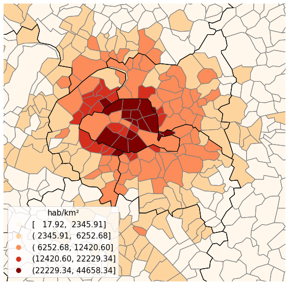
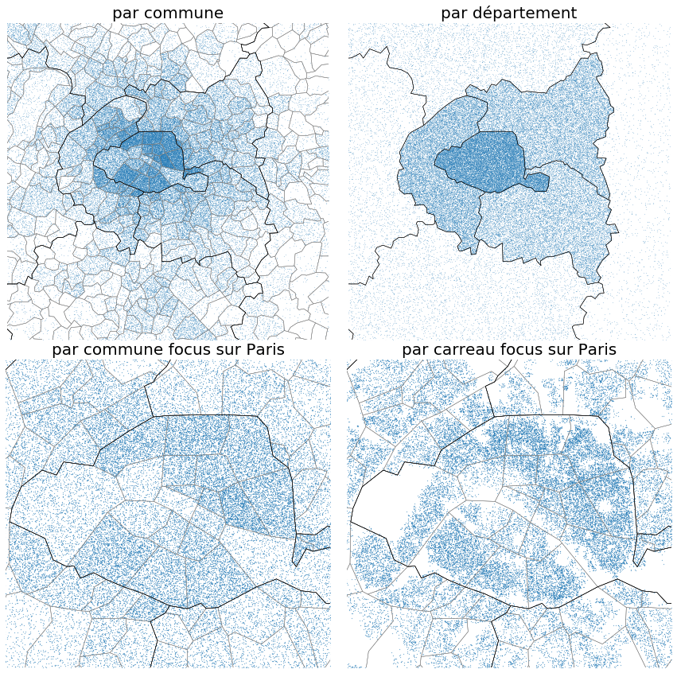
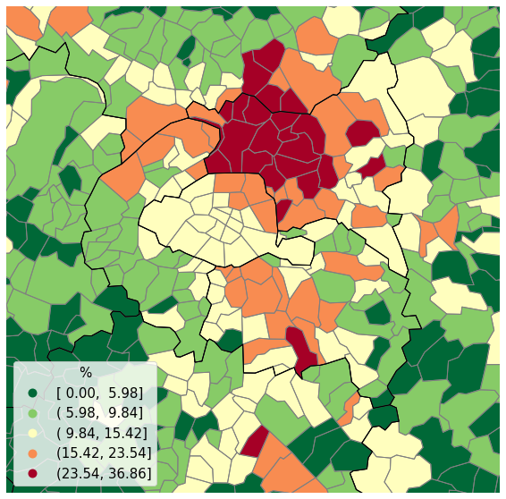
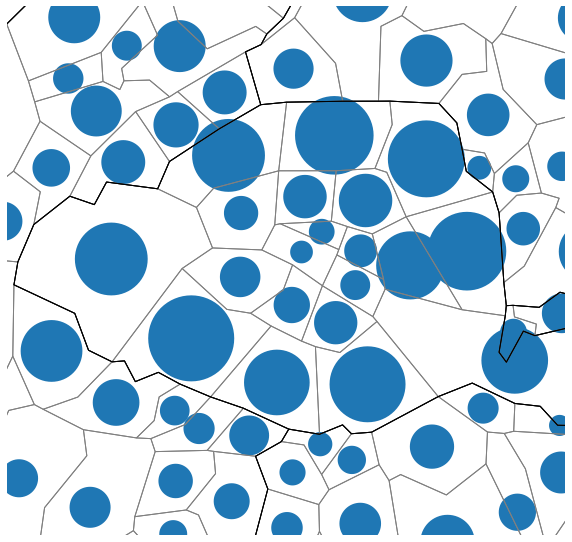

Les fondements de la sémiologie cartographique 
===================================================

Une carte thématique a vocation à représenter l'organisation spatiale d'une quantité déterminée. Deux types de cartes (en dehors des cartes de flux) sont principalement utilisés : les cartes en aplat de couleur et les ronds. Les premières servent à cartographier des ratios et les secondes des volumes (la surface des ronds est proportionnelle à la variable d'intérêt). Ces règles immuables que d'aucuns considèrent comme des conventions trouvent leur justification dans la manière dont on envisage la spatialisation des données étudiées. 

Les cartes choroplèthes (aplats de couleur)
--------------------------------------------
Les cartes de densité
^^^^^^^^^^^^^^^^^^^^^^

La carte de densité est la carte de ratio la plus simple, le dénominateur est la surface des unités spatiales considérées. L'unité de la légende est une population par unités de surface. Sur la figure ci-dessous a été représentée la densité de population communale autour de Paris. L'intensité du dégradé de couleur est croissante avec la densité.
 

   
   Densité de population autour de Paris. Souce :  RP 2017

Construire une carte de densité revient implicitement à postuler que la population est répartie uniformément dans les unités spatiales. Cette idée a été schématisée sur la figure ci-dessous à l'aide de cartes à points. Chaque point bleu représente 100 personnes. Lorsque la densité au sein d'une unité spatiale est forte, les points ont tendance à occuper l'ensemble de son espace. Au contraire, pour les unités spatiales de faible densité, la population est dispersée et semble disparaître dans l'immensité du vide apparent. Ce simple procédé crée un dégradé bleu qui oppose les zones denses aux zones peu denses (**par commune**). Les cartes en aplat de couleur de densité sont juste une formalisation plus simple de ce constat.  

   
   Chaque point représente 100 personnes. Source : Insee Rp 2017 et Filosofi 2015

Les trois autres cartes **par département**, **par commune focus sur Paris** et **par carreau focus sur Paris** illustrent le *Modifiable Areal Unit Problem*. La répartition de la population change drastiquement en fonction de la taille des unités spatiales considérées. A l'échelle des départements, la variabilité communale est masquée. A l'échelle des communes, la répartition fine de la population contenue dans les carreaux de 200 m est invisible.

Les cartes de taux
^^^^^^^^^^^^^^^^^^
Une carte de taux cherche à représenter les relations spatiales entre deux variables. La carte du taux de pauvreté autour de Paris (\\ \frac{\text{Ménages pauvres}}{\text{Ménages}} \\) est un exemple de carte de taux. Dans un souci de pédagogie, un dégradé de couleur combinant deux teintes a été appliqué à cette carte. **Ceci n'est pas recommandé en général.**

   
   Carte de taux. Source : Insee Filosofi 2015

Lorsque l'on réalise une carte de taux, on considère que les variables au numérateur et au dénominateur sont réparties uniformément dans l'espace. Sur la carte de points ci-dessous deux types de ménages sont représentés :  en rouge, les ménages pauvres et en vert les ménages non pauvres. En fonction du niveau de surreprésentation des ménages pauvres les espaces apparaissent plus ou moins rouges ou verts et l'on retrouve encore l'idée du dégradé de couleurs.  

.. figure:: _static/taux.png
   :width: 300
   
   Carte de points. Chaque point représente 50 ménages : en rouge, les ménages pauvres et en vert les ménages non pauvres. Source : Insee Filosofi 2015

Attention, certaines zones très peu denses ont trop peu de points pour que l'on observe un amas vert ou rouge. En recourant à des cartes en aplat on perd cette information sur la densité sous-jacente ! **Il est donc fondamental de faire très attention aux commentaires de ce type de carte et de ne pas surinterpréter ce qui se passe dans des zones quasi vides.**

Les cartes en rond
--------------------

Une carte en rond est une autre manière de représenter la répartition d'une population. La surface des ronds est proportionnelle à la population contenue dans les unités spatiales (cf figure ci-dessous).

  
   Carte en rond de la population communale. Source : RP 2017
   
Produire une carte en rond revient à regrouper les populations aux centres des unités spatiales et à affecter à chaque personne la même quantité d'espace. Sur la carte ci-dessous (**représentation en rond**), chaque point représente 100 personnes. Les points ont été positionnés au centre de carreau de 150 m  de coté. Autrement dit, chaque personne reçoit 150 * 150 / 100 = 225 m². Cette représentation n'est pas plus fausse que celle des cartes de densité. Les cartes de densité et en rond sont simplement basées sur des modélisations différentes de la population. 

.. figure:: _static/rond.png
   :width: 600

   Carte de taux des ménages pauvres un point représente 1000 personnes

