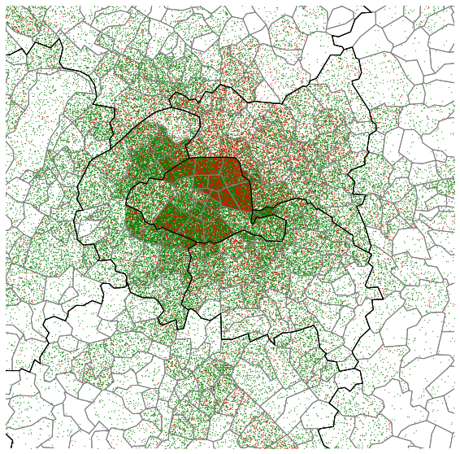

Discussion des règles de sémiologie cartographique 
===================================================

Une carte thématique a vocation à représenter l'organisation spatiale d'une quantité déterminée. Deux types de cartes (en dehors des cartes de flux) sont principalement utilisés : les cartes en aplat de couleur et les ronds. Les premières servent à cartographier des ratios et les secondes des volumes (la surface des ronds est proportionnelle à la variable d'intérêt). Ces régles immuables que d'aucuns considérent comme des conventions trouvent leur justification dans la manière dont on envisage la spatialisation des données étudiées. 

Les cartes choroplèthes (aplats de couleur)
--------------------------------------------

La carte de densité est la carte de taux la plus simple, le dénominateur est la surface des unités spatiales considérées. L'unité de la légende est la variable d'intérêt par unité de surface. 
 
.. figure:: _static/carte_densite.png
   :width: 300

.. figure:: _static/carte_taux.png
   :width: 600

Chaque point représente 100 personnes

Carte de taux. Chaque point représente 50 ménages : en rouge, les ménages pauvres et en vert les ménages non pauvres

.. figure:: _static/carte_rond.png
   :width: 600

.. figure:: _static/rond.png
   :width: 600

Carte de taux des ménages pauvres un point représente 1000 personnes

